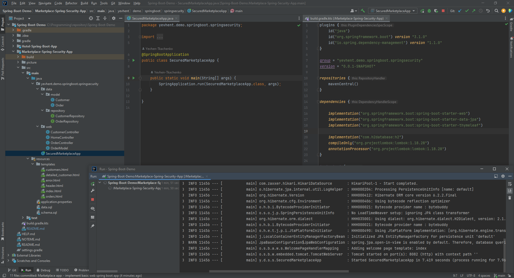
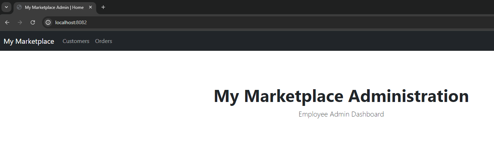
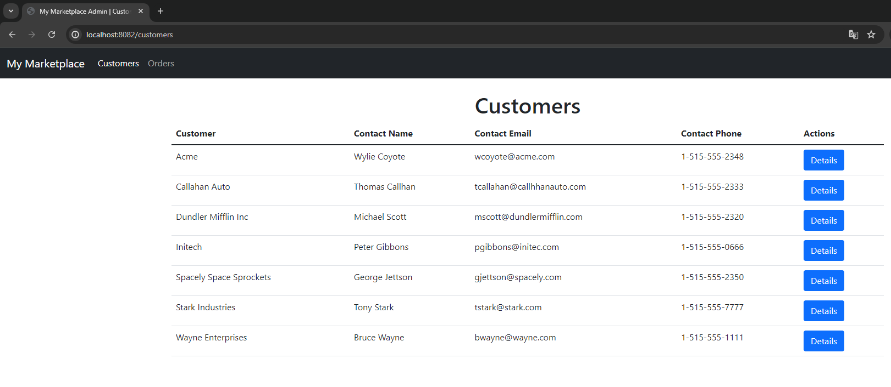
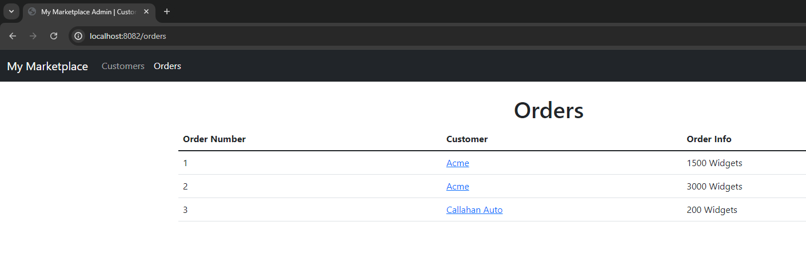
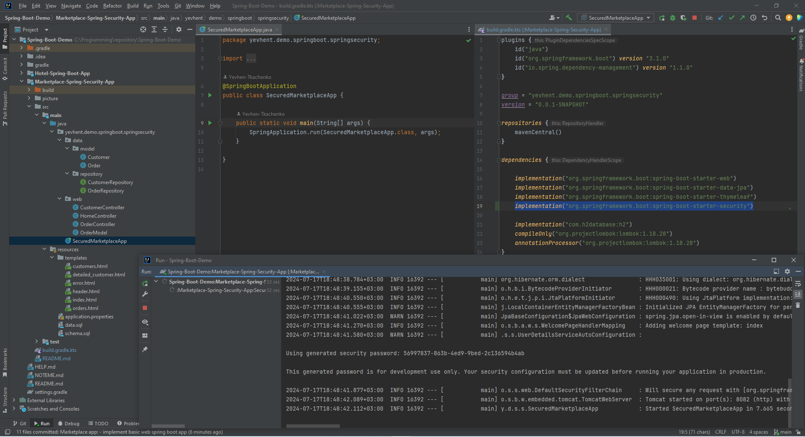
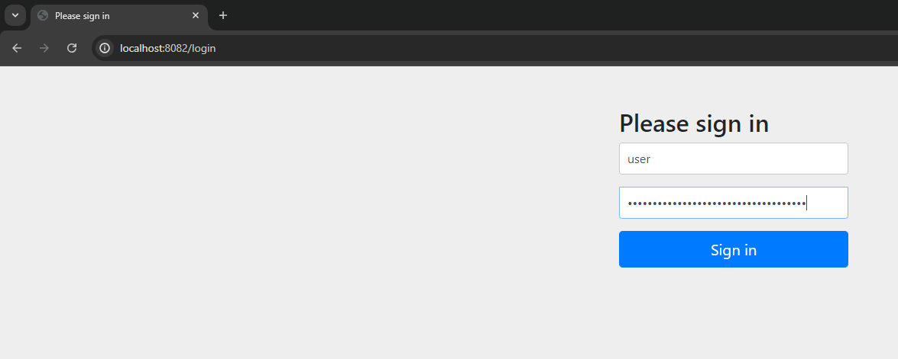
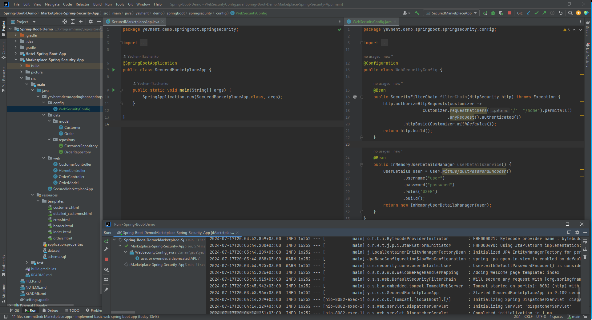
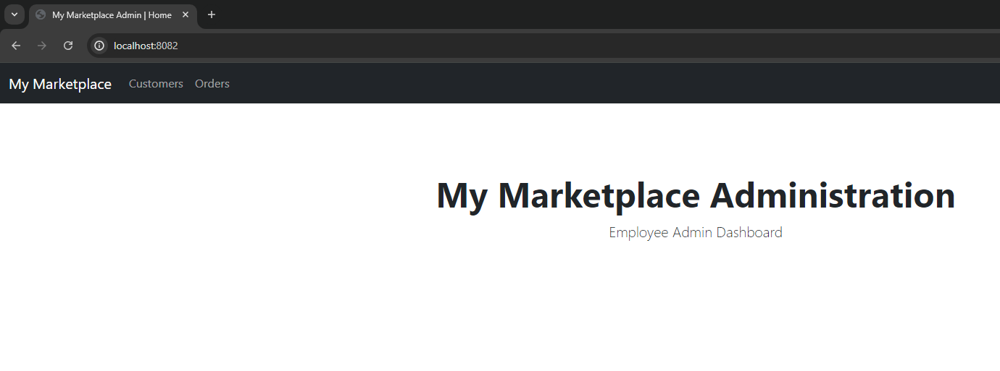
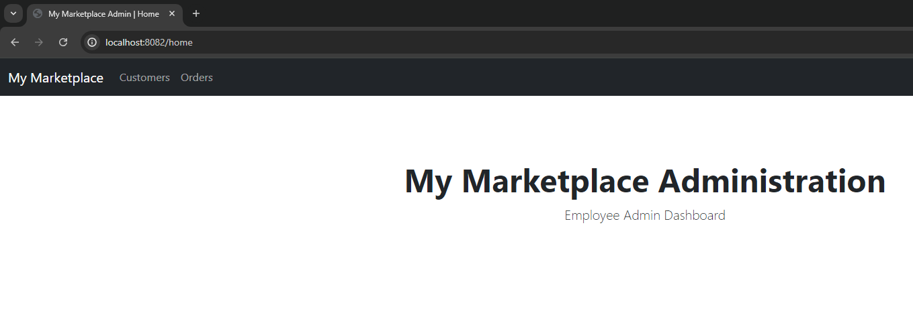
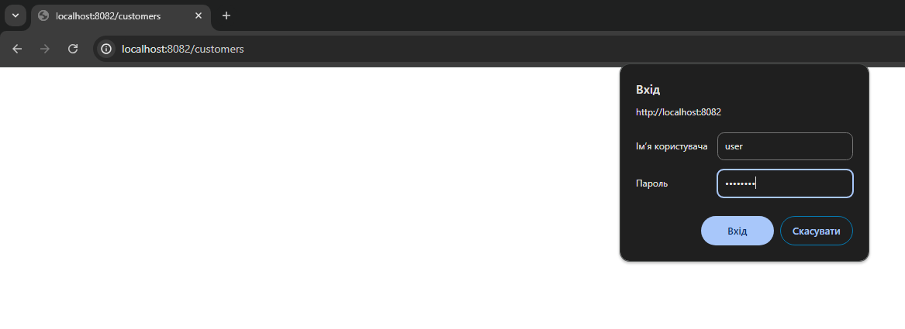

# Marketplace Spring-Security app

Implemented based on LinkedIn learning course:
[Spring: Spring Security](https://www.linkedin.com/learning/spring-spring-security-15832928)

### Tech stack

- Java 17
- Gradle
- Spring Security
- H2 database
- Lombok

There is Marketplace web app where we use next Spring Security features:

* [In-Memory Authentication (non-production)](#in-memory-authentication-non-production-)

#### In-Memory Authentication (non-production) 

We start from basic Web Spring Boot app.
Let's check project structure and start service:

As we can see, in `build.gradle` file we have standard dependencies for Spring Boot web app.

As soon as app is up and running we can easily access all the endpoints.

Home:

Customers:

Orders:

Now let's introduce Spring Security by doing small change in `build.gradle` file.
We are adding just one line dependency `implementation("org.springframework.boot:spring-boot-starter-security")`
and run our app again:

At that time when we try to access any endpoint, we are getting redirected to `/login` page:

So, app is accessible only with `username` and `password`.
By default, in Spring Security `username` is `user` and password generated each time we run service.
In our case it's `56997...` as we can see on screenshot above (IntelliJ logs output).

Let's customize default Spring Security implementation (still it should NOT be in production):

We've added custom HTTP filtration, in order to make HOME page open, but other endpoints remain secured.
As soon as app is up and running we can easily access endpoints:

`localhost:8082/`:

`localhost:8082/home`:

But credentials are required for others:

Now, we have to type `user` as `username` and `password` as `password` (as specified in our configuration class)
