# Marketplace Spring-Security app

Implemented based on LinkedIn learning course:
[Spring: Spring Security](https://www.linkedin.com/learning/spring-spring-security-15832928)

### Tech stack

- Java 17
- Gradle
- Spring Security
- H2 database
- Lombok

There is Marketplace web app where we use next Spring Security features:

* [In-Memory Authentication (non-production)](#in-memory-authentication-non-production)
* [JDBC User Authentication (non-production)](#jdbc-user-authentication-non-production)
* [BCrypt hashing for passwords](#bcrypt-hashing-for-passwords)
* [Form-based authentication](#form-based-authentication)
* [Authorization: User Roles](#authorization-user-roles)

#### In-Memory Authentication (non-production)

We start from basic Web Spring Boot app.
Let's check project structure and start service:

As we can see, in `build.gradle` file we have standard dependencies for Spring Boot web app.

As soon as app is up and running we can easily access all the endpoints.

Home:

Customers:

Orders:

Now let's introduce Spring Security by doing small change in `build.gradle` file.
We are adding just one line dependency `implementation("org.springframework.boot:spring-boot-starter-security")`
and run our app again:

At that time when we try to access any endpoint, we are getting redirected to `/login` page:

So, app is accessible only with `username` and `password`.
By default, in Spring Security `username` is `user` and password generated each time we run service.
In our case it's `56997...` as we can see on screenshot above (IntelliJ logs output).

Let's customize default Spring Security implementation (still it should NOT be in production):

We've added custom HTTP filtration, in order to make HOME page open, but other endpoints remain secured.
As soon as app is up and running we can easily access endpoints:

`localhost:8082/`:

`localhost:8082/home`:

But credentials are required for others:

Now, we have to type `user` as `username` and `password` as `password` (as specified in our configuration class)

#### JDBC User Authentication (non-production)

Previously we had credentials in runtime memory of app.
Now, let's store sensitive data as corresponding entities in DB
and configure Spring to use JDBC User Details as suggested in
[official docs](https://docs.spring.io/spring-security/reference/servlet/appendix/database-schema.html#_user_schema):

As shown on the picture:

- updated schema to have `User` and `Authority` Entities
- inserted some data as plain text (which is not production way)
- updated Spring Configuration to use  `JdbcUserDetailsManager` implementation
- added Spring Configuration to encode passwords from DB - no encoding in our case (which is not production way)

As soon as app is up and running we can easily access endpoints:

`localhost:8082/`, `localhost:8082/home`:

But still, credentials are required for others.

For example, we can use user `admin` for Orders page:

And, for example, we can use user `Yevhen` for Customers page:

with passwords hardcoded in `data.sql`.

For now, no authority matters (`ROLE_ADMIN` or `ROLE_USER`).

#### BCrypt hashing for passwords

Now, let's improve way of storing passwords in DB.
We will use BCrypt hashing to store generated values instead of plain text.
We can use online encryption like [this](https://bcrypt-generator.com/).

So, we have to replace passwords in `data.sql` and change encoder in Spring Config:

Nothing changed for the Users, they still use simple passwords as it was before:

Admin:

Yevhen:

but internally Spring Security authenticates as like this

`Boolean isMatch = passwordEncoder().matches(enteredPassword, dbHashedPassword);`

#### Form-based authentication

In previous section, we've seen basic authentication with UI fields provided by default.
This is non-production case in terms of functionality limitations.
For example, we would like to have customized UI Form or logout feature.

Now, we are going to implement custom approach for User to login/logout.

Let's start from HTML changes:

We added 2 buttons:

- `login` is visible when User is not authenticated
- `logout` is visible when User is

Also, there we have new template for `Login` page.

Next we have to add dependency to make Thymeleaf elements work (with version according to Spring Boot version)

Now, we are good to implement java changes:

We've added

- new endpoint for login page
- filters for User to be redirected to `login`
- `logout` action settings

Once app is up and running we can easily access homepage and see `login` button:

For example, if User tries to open Customers tab, he will get `Login` page:

Once signed in, User is able to see content and has button `Logout` to invalidate session:

By clicking logout we get back to `Login` page with corresponding message:

#### Authorization: User Roles

In previous section we already introduced schema and data for user Roles:

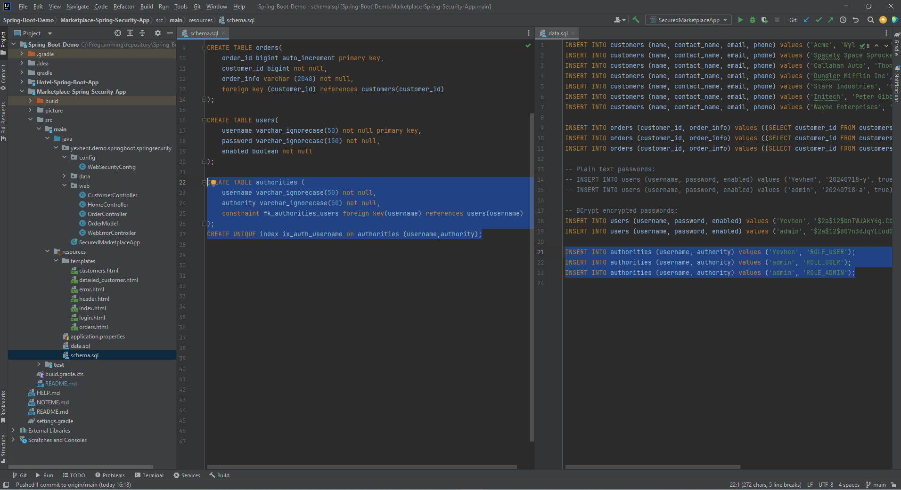

Now, let's implement User access to content depending on its `ROLE`.

First, add validation on UI:

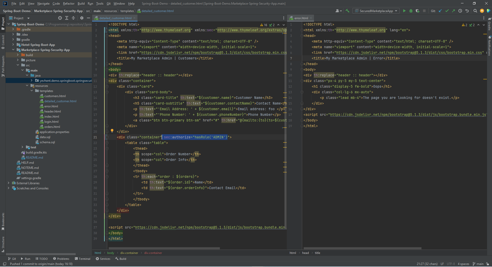

Only `ADMIN` users will be able to see Orders.
Also, there we have corresponding error page.

Next let's add validation on server side: non-Admin user will have empty list of Orders in details of Customer page.
Also, we are going to have new Controller for error page:

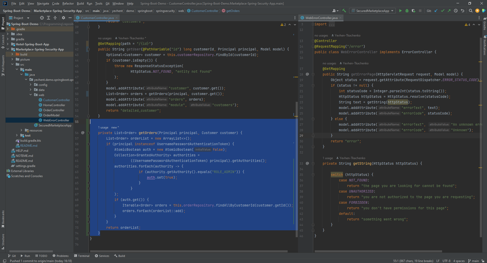

Finally, we add filtration on User access to pages:

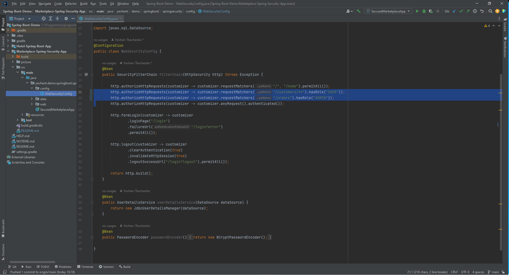

Once app is up and running we can sing in
by clicking `Login` button as a user `Yevhen` which has `USER` role:

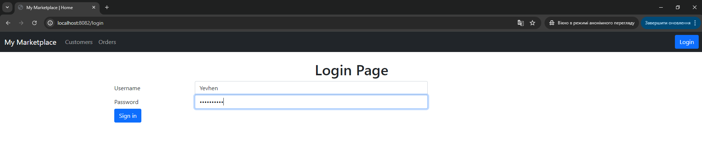

Next, let's try to open Customers page:

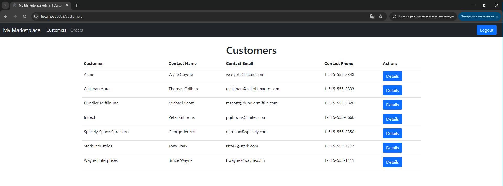

As `Yevhen` we can access it, and see `Customer Details` with no `Orders`:

And we don't have access to Orders page:

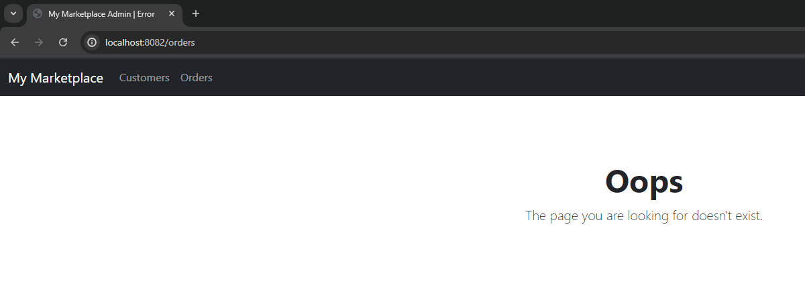

Now, let's logout and login as a user `admin` which has `ADMIN` role:

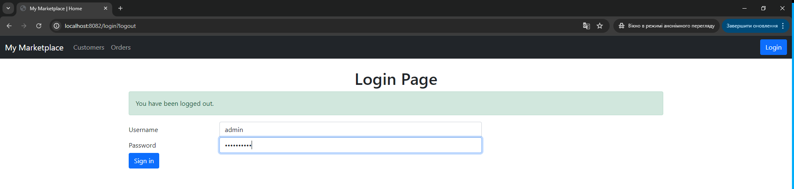

In addition to `USER` role, `ADMIN` role shows as `Orders` in `Customer Details`:

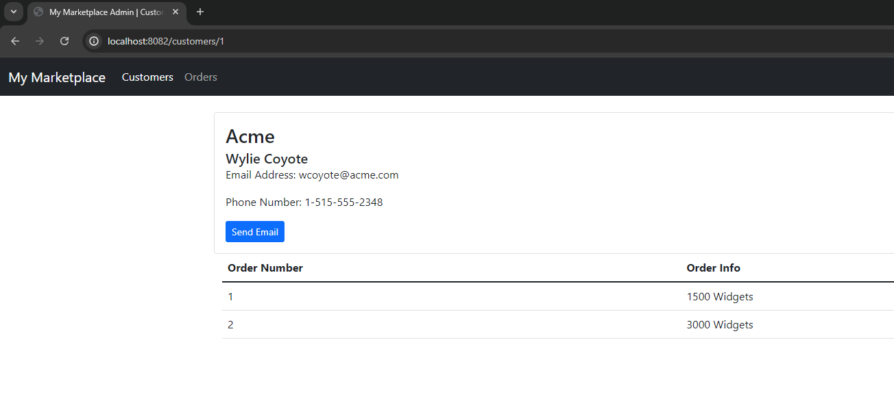

and provides access to Orders page:

#### OAuth2 authentication

Going back to authentication, we are going to migrate from Form-based to GitHub provided login.

This will be the simplest solution with no authorization neither logout.

First, we have to set up our App as a client for GitHub authorization service, 
for example as described [here](https://spring.io/guides/tutorials/spring-boot-oauth2#github-register-application).

Then, we are ready to implement OAuth2 on our app side,
let's start with dependency:

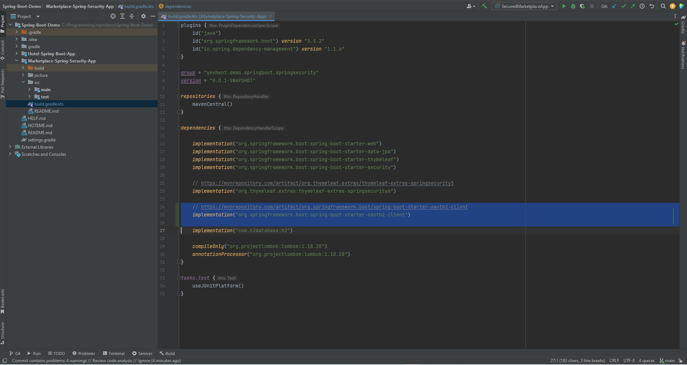

Next, we comment Form authentication and add OAuth2:

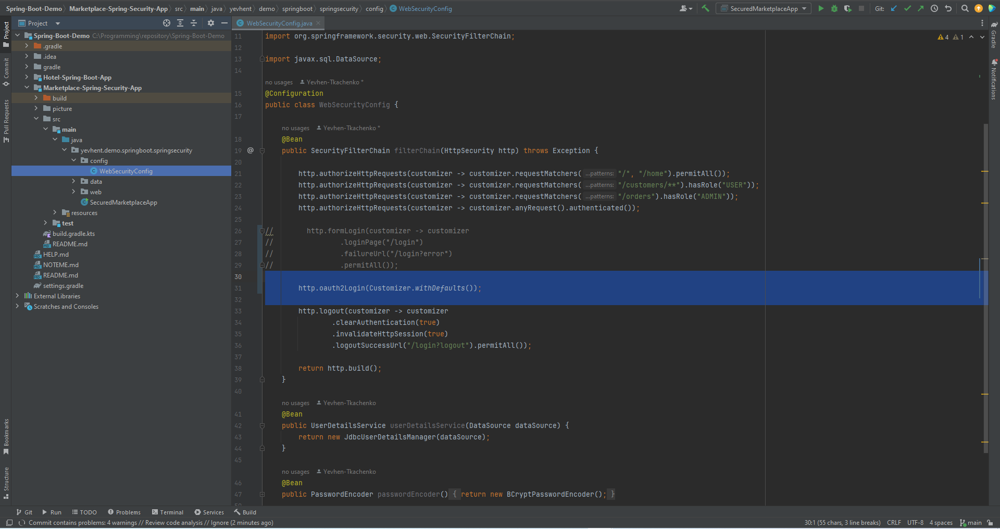

Now, let's put our credentials provided by GitHub into app properties. 
Actual values we store in Env variables for security reason:

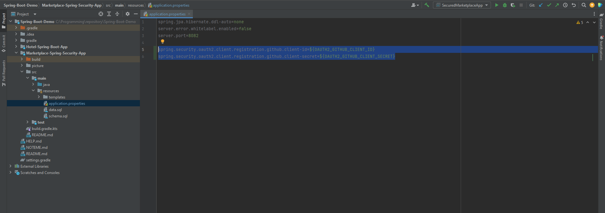

When we start app and open app in browser, we have Login option:

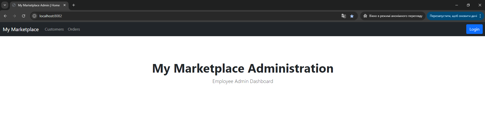

Upon clicking login, we are navigated to OAuth2 login page:  

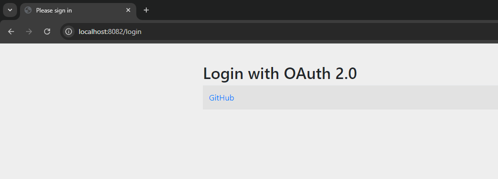

And by clicking GitHub we finally redirected to GitHub authentication:

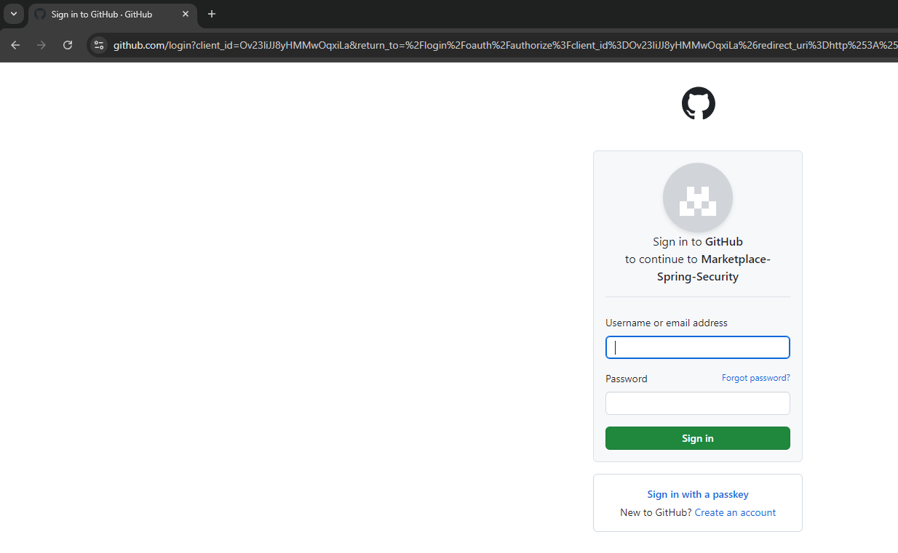

After successful login and going to Order page, we get such error as don't have right authorization settings:

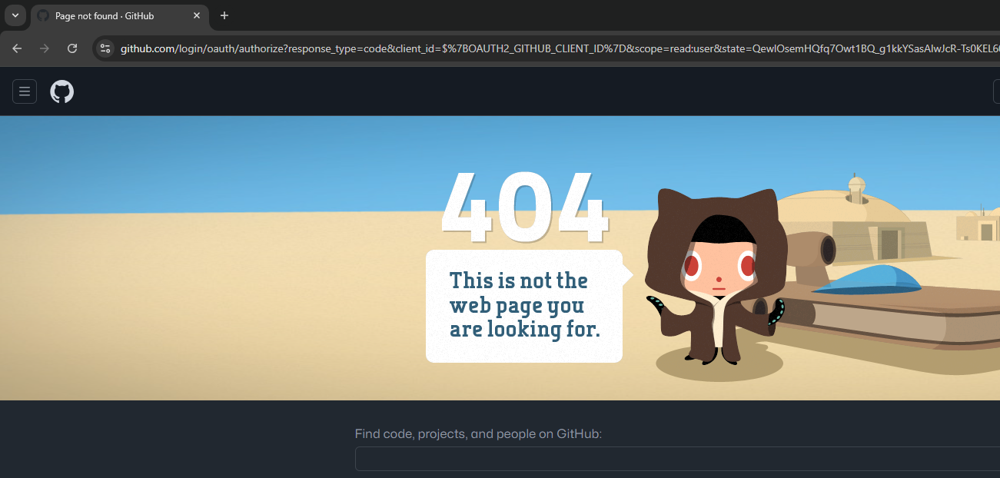

Anyway, we achieved GitHub OAuth2 login and GitHub error handling in case of missing rights.
